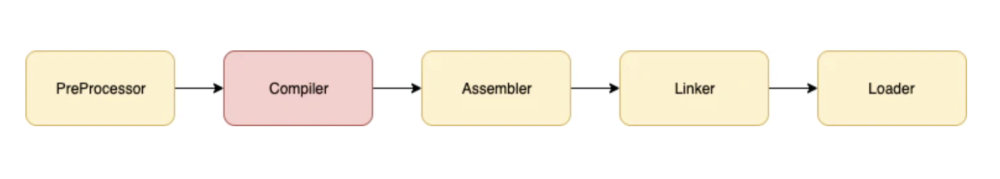
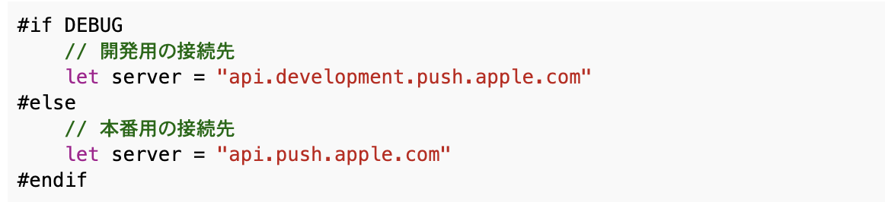
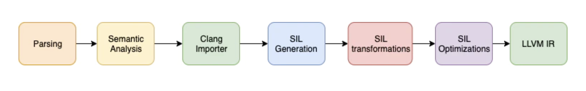
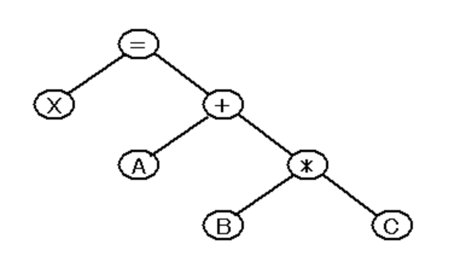
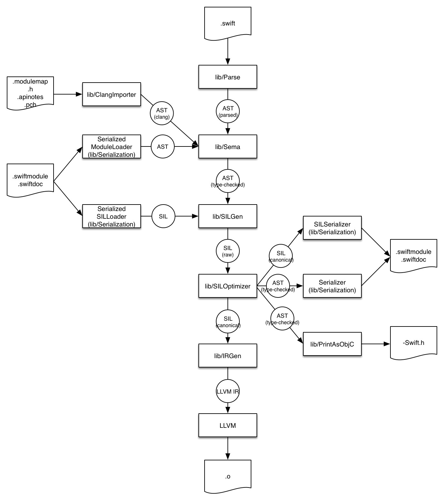

# XcodeでのSwiftのビルドについて

### ■ ビルド全体の処理の流れ

1. PerProcessor
2. Compiler
3. Assembler
4. Linker
5. Loader

### ■ 図解


----

### 1. PreProcessor
1. PreProcessorのディレクティブ(#if DEBUGなど)を解決



2. 依存関係の発見
3. マクロをそれぞれの定義へ置換（マクロの例：$(PRODUCT_NAME)）
4. Compilerへプログラムを送り込めるように変換


参考：[Swift(Xcode)でプリプロセッサを使う](https://mike-neko.github.io/blog/buildconf/)

----

### 2. コンパイルの流れ

### ■ 図解


参考：[Appleのコンパイラ技術](https://codezine.jp/article/detail/8768)

<br>

 1. Parsing :
 ソースコードを型情報なしのAbstract Syntax Tree (AST)に変換します。ここでは意味の情報も、型の情報も扱いません。ソースに文法の問題があるときはメッセージを出します。 <br>
    

 1. Semantic analysis：
parseされたASTを整形された型チェック済みのASTに変換します。意味の問題があるときはメッセージを出します。ここには型推論が含まれます。

 1. Clang importer：
 [Clang modules](http://clang.llvm.org/docs/Modules.html)をインポートします。そしてCやObjective-CのAPIと対応するSwiftのAPIをmapします

 1. SIL generation（SILの生成）：
 Swift Intermediate Language (SIL)とはSwiftコードのさらなる分析と最適化に適した、高レベルのSwift固有の中間言語。
    - コマンドイメージ：
        ```swiftc 
            $ swiftc -emit-silgen xxxx.swift
        ```

 1. SIL guaranteed transformations（SILの正規化）：変数の初期化などのデータの流れを診断します。この工程を終えると“canonical(正式な)” SILとなります。
    - コマンドイメージ：
        ```swiftc 
            $ swiftc -emit-sil xxxx.swift
        ```

 1. SIL Optimizations（SILの最適化）：例えばARCの最適化、非仮想化、ジェネリック分析、ARCなどの最適化を行います。
     - コマンドイメージ：
        ```swiftc
            $ swiftc -O -emit-sil xxxx.swift
            $ swiftc -O -Xllvm -sil-print-all xxxx.swift
        ```

        ●SILについてもっと詳しく知りたい方は  
        - 日本語で分かりやすい　⇨ https://blog.waft.me/2018/01/09/swift-sil-1/
        - 本家　⇨ [swift/docs/SIL.rst](https://github.com/apple/swift/blob/main/docs/SIL.rst)
        - [(本家:Swift Compiler)](https://swift.org/swift-compiler/)

 1. LLVM IR Generation： IR generationはSILをLLVM IRに変換されます。ここからLLVMによる最適化と機械語生成へと続いていきます。
      - コマンドイメージ：
        ```swiftc
            $ clang -S -emit-llvm xxxx.swift
        ```
     - ソース例：
        ```llvm
            %tmp9 = getelementptr %struct.munger_struct, %struct.munger_struct* %P, i32 0, i32 0
            %tmp = getelementptr %struct.munger_struct, %struct.munger_struct* %P, i32 1, i32 0
            %tmp6 = getelementptr %struct.munger_struct, %struct.munger_struct* %P, i32 2, i32 1
        ```

        ● LLVMについてもっと詳しく知りたい方は
        - 低レベル仮想マシン（Low Level Virtual Machine）。
        - LLVMはプログラミング言語を作成する為の基盤。
        - LLVMは、中間および/またはバイナリマシンコードの構築、最適化、および生成に使用される、`C++` で書かれたライブラリです。
        - LLVMはコンパイラフレームワークとして使用できます。
        コンパイラフレームワークでは、下記２種類ある。
          - `「フロントエンド」（パーサーとレクサー）`
          - `「バックエンド」（LLVMの表現を実際のマシンコードに変換するコード）`
        - 他の言語でコンパイルされたLLVMの言語とリンクする事ができるので、
        自分で作った言語でC言語の関数を、SwiftやObjective-Cから、直接使ったりすることができます。
         

         参考：
          - 本家 ⇨ [The LLVM Compiler Infrastructure](Overview)
          -  [こわくないLLVM入門](https://qiita.com/Anko_9801/items/df4475fecbddd0d91ccc)
          -  [1日でSwiftコンパイラを作る！Swiftコンパイラインターンを開催しました](https://qiita.com/megane814/items/ef3f4f44eae31e0560a0)


    ### ■ コンパイル時のソースの変化
 
     `[swfit] -> [Swift AST] -> [SIL] -> [LLVM IR] -> [オブジェクトファイル(.o)]`

    - 

----

### ■ Assembler
    人が読めるアセンブリコードを
    メモリ内のどの領域に配置しても実行できるマシンコード(機械語)に変換して
    コードとデータを集めたMach-Oファイルを作成
----

### ■ Linker
    iOSやmacOS上で動作するように
    様々なオブジェクトファイルとライブラリをまとめて
    ひとつのMach-O実行ファイルを作成します。

    ※ Mach-O(マーク・オー)
     Mach-OとはMach objectの略で、
     iOSデバイスのARMプロセッサ、MacのIntelプロセッサ上で動作します。
     中間形式(リンク前)にも最終形式(リンク後)にも用いられる。コード、データの両方を格納できる。（拡張子：なし、.o、.a、.dylib）
     
     Mach-Oは一つのファイルが一つのアーキテクチャ(CPU)に対応する。
     複数のアーキテクチャをまとめることも出来き、複数のアーキテクチャを纏めると、Universal Binaryとなる。
    
- 例：    
`[.o] + [dylib] + [.a] + [.tbd] => [実行ファイル]`

- コマンドイメージ：
     ```swiftc
        //lipoでまとめる時
        $ clang -o test.arm -arch arm64 test.c
        $ clang -o test.x86_64 -arch x86_64 test.c  
        $ lipo -create test.arm test.x86_64 -output test

        //clangで生成
        $ clang -arch x86_64 -arch arm64 -o test test.c

        //fileで中身を確認
        $ file test
        test: Mach-O universal binary with 2 architectures: [x86_64:Mach-O 64-bit executable x86_64] [arm64:Mach-O 64-bit executable arm64]
        test (for architecture x86_64): Mach-O 64-bit executable x86_64
        test (for architecture arm64):  Mach-O 64-bit executable arm64
     ```

 - Xcode上でよく見るエラー
     - 「Apple Mach-O Linker Error」
     - 「linker command failed with exit code 1」

 - 参考：
     - [第12回　Universal Binary【前編】](https://www.itmedia.co.jp/enterprise/articles/0711/30/news014_3.html)
     - [第13回　Universal Binary【後編】](https://www.itmedia.co.jp/enterprise/articles/0712/27/news012_3.html)
----

### ■ Loader
    OSの機能の一部でプログラムをメモリに載せて実行します。

    プログラム実行に必要なメモリ領域の確保
    レジスターを初期状態に初期化
    dylibsや他のDynamicライブラリーのロード
    このロード時間がアプリの起動時間に比例します。

----

参考サイト：
 - [マンドラインから直接Swiftコンパイラを使ってビルドする方法](https://qiita.com/omochimetaru/items/428324ed8bcd2b98dacb)
 - [【iOS】Xcodeのビルドの仕組みを知り、ビルド時間を短縮する方法を探る](https://qiita.com/shiz/items/b8d5126210de736d7986)
 - [Swift Compiler Architecture (Swiftコンパイラの構造)](https://samekard.blogspot.com/2015/12/swift-compiler-architecture.html)
 - [コンパイラ構築の概要](http://shopping2.gmobb.jp/htdmnr/www08/lp2016/chap05/compiler.html)
- [swiftcコマンド まとめ](https://qiita.com/ysn/items/cf449cb28adafaed956b)